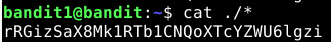

# Over The Wire - Bandit

## Level 0

### Level Goal
The goal of this level is for you to log into the game using SSH. The host to which you need to connect is bandit.labs.overthewire.org, on port 2220. The username is bandit0 and the password is bandit0. Once logged in, go to the Level 1 page to find out how to beat Level 1.

### Solution
```
$ ssh bandit0@bandit.labs.overthewire.org -p 2220
```


## Level 0 --> Level 1

### SSH Connection
```bash
$ ssh bandit1@bandit.labs.overthewire.org -p 2220
```

### Level Goal
The password for the next level is stored in a file called readme located in the home directory. Use this password to log into bandit1 using SSH. Whenever you find a password for a level, use SSH (on port 2220) to log into that level and continue the game.

### Solution


## Level 1 --> Level 2

### SSH Connection
```bash
$ ssh bandit2@bandit.labs.overthewire.org -p 2220
```

### Level Goal
The password for the next level is stored in a file called - located in the home directory

### Solution





## Level 2 --> Level 3

### SSH Connection
```bash
$ ssh bandit3@bandit.labs.overthewire.org -p 2220
```

### Level Goal
The password for the next level is stored in a file called spaces in this filename located in the home directory

### Solution


```bash
pwd: aBZ0W5EmUfAf7kHTQeOwd8bauFJ2lAiG
```

## Level 3 --> Level 4

### SSH Connection
```bash
$ ssh bandit4@bandit.labs.overthewire.org -p 2220
```

### Level Goal
The password for the next level is stored in a hidden file in the inhere directory.

### Solution


```bash
pwd: 2EW7BBsr6aMMoJ2HjW067dm8EgX26xNe
```

## Level 4 --> Level 5

### SSH Connection
```bash
$ ssh bandit5@bandit.labs.overthewire.org -p 2220
```

### Level Goal
The password for the next level is stored in the only human-readable file in the inhere directory. Tip: if your terminal is messed up, try the “reset” command.

### Solution


```bash
pwd: lrIWWI6bB37kxfiCQZqUdOIYfr6eEeqR
```

## Level 5 --> Level 6

### SSH Connection
```bash
$ ssh bandit6@bandit.labs.overthewire.org -p 2220
```

### Level Goal
The password for the next level is stored in a file somewhere under the inhere directory and has all of the following properties:
- human-readable
- 1033 bytes in size
- not executable

### Solution


OR

```bash	
$ find . -size 1033c | xargs cat
```

```bash
pwd: P4L4vucdmLnm8I7Vl7jG1ApGSfjYKqJU
```

## Level 6 --> Level 7

### SSH Connection
```bash
$ ssh bandit7@bandit.labs.overthewire.org -p 2220
```

### Level Goal
The password for the next level is stored somewhere on the server and has all of the following properties:
- owned by user bandit7
- owned by group bandit6
- 33 bytes in size

### Solution

```bash	
$ find / -type f -user bandit7 -group bandit6 -size 33c
```

```bash	
file: /var/lib/dpkg/info/bandit7.password
```

```bash
$ cat /var/lib/dpkg/info/bandit7.password
```

```bash
pwd: z7WtoNQU2XfjmMtWA8u5rN4vzqu4v99S
```