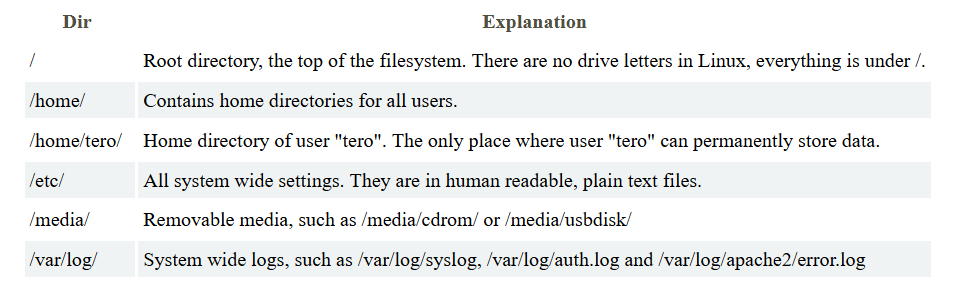

# Command Line Basics - Summary

This is a summary of the Command Line Basics WebPage of Tero Karvinen's course.

## Table of Contents
1. Moving and Looking Around
2. File Manipulation
3. SSH Remote Control
4. Help
5. History and Guessing
6. Important directories
7. Administrative Commands

## 1. Moving and Looking Around

### 1.1. Print Working Directory
```console
$ pwd
```
### 1.2. List Files
```console
$ ls
```
### 1.3. Change Directory
```console
$ cd example/
```
### 1.4. Change Directory Up
```console
$ cd ..
```
### 1.5. View File
```console
$ less example.txt
```

## 2. File Manipulation

### 2.1. Text Editor
```console
$ nano example.txt
```
### 2.2. Create New Directory
```console
$ mkdir example
```
### 2.3. Rename Directory
```console
$ mv example/ example2/
```
### 2.4. Copy Directory
```console
$ cp -r example/ example2/
```
### 2.5. Remove an empty Directory
```console
$ rmdir example/
```
### 2.6. Remove a File
```console
$ rm example.txt
```
### 2.7. Remove a Directory and its contents
```console
$ rm -r example/
```

## 3. SSH Remote Control

### 3.1. Open a SSH Connection
```console
$ ssh username@example.com
```
### 3.2. Exit back to local machine
```console
remotecomputer$ exit
```
### 3.3. Securly copy a folder to remote machine
```console
$ scp -r example/ username@example:public_html/
```

## 4. Help

### 4.1. Show manual for a command
```console
$ man ls
```
### Short help
```console
$ ls --help
$ wget -h
```

## 5. History and Guessing

### 5.1. Tab twice shows possible commands
```console
$ ls example/[tab][tab]
```
### 5.2. History
```console
$ history
```

## 6. Important directories



## 7. Administrative Commands

### 7.1. Update list of available packages
```console
$ sudo apt-get update
```
### 7.2. Search for software with keywords
```console
$ apt-cache search dungeon adventure
```
### 7.3. Install software
```console
$ sudo apt-get -y install example
```