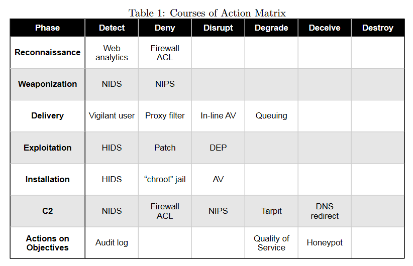

# Intelligence-Driven Computer Network Defense - Summary

## Table of Contents
1. Introduction
2. Related Work
3. Intelligence-Driven Computer Network Defense
    1. Indicators and the Indicator Life Cycle
    2. Intrusion Kill Chain
    3. Course of Action
    4. Intrusion Reconstruction
    5. Campaign Analysis
4. Conclusion

## 1. Introduction
Malicious users have been exploiting vulnerabilities in global computer networks since their inception.
APTs, or Advanced Persistent Threats, are a new class of threats that aim to compromise data for economic or military gain and are the largest risk facing some industries.
Conventional incident response methods are not effective in addressing APTs.
Advances in infrastructure management tools have reduced vulnerabilities in networked services, but APT actors continue to use advanced tools, customized malware, and "zero-day" exploits that anti-virus and patching cannot detect or mitigate.
Responses to APT intrusions require an evolution in analysis and response capabilities.

## 2. Related Work
The "kill chain" model, which is used by the U.S. Department of Defense and the U.S. Air Force to identify gaps in intelligence, surveillance, and reconnaissance capabilities.
And the "IED threat chain" model, which is used to model Improvised Explosive Device attacks and to coordinate intelligence and defensive efforts at each stage of the chain.
Phase-based models have been used in the information security field, and the exploitation life cycle model proposed by Mandiant, with a focus on early detection and mitigation in the intrusion kill chain to defend against APT actors.

## 3. Intelligence-Driven Computer Network Defense
Intelligence-driven computer network defense is a risk management strategy that addresses the threat component of risk by analyzing adversaries, their capabilities, objectives, doctrine, and limitations, and leveraging indicators to discover new activity.
The kill chain model is useful as it allows defenders to implement countermeasures faster than adversaries can evolve, raising the costs for the adversary and showing that defenders have no inherent disadvantage over attackers.

### 3.1. Indicators and the Indicator Life Cycle
There is three types of indicators:
1. Atomic: They can not be broken down into smaller pieces.
2. Computed: They are derived from data involved in the attack.
3. Behavioral: They are a collection of computed and atomic indicators.

### 3.2. Intrusion Kill Chain
There is seven phases in the intrusion kill chain:
1. Reconnaissance: The adversary gathers information about the target by using social engineering, scanning, and other methods.
2. Weaponization: The adversary creates a weapon to exploit the target by using custom malware, zero-day exploits, or other methods.
3. Delivery: The adversary delivers the weapon to the target by using spear phishing, watering hole attacks, or other methods.
4. Exploitation: The adversary exploits the target by using the weapon to gain access to the target's network. It often targets a vulnerability in the target's network.
5. Installation: The adversary installs a backdoor or other persistent access mechanism to maintain access to the target's network.
6. Command and Control: The adversary uses the backdoor to control the target's network.
7. Actions on Objectives: The adversary uses the target's network to achieve its objectives.

### 3.3. Course of Action
You can use a Table that depicts the kill chain and the course of action for each phase:

### 3.4. Intrusion Reconstruction
Analysts must discover many attributes for each phase of an intrusion to enumerate the maximum set of options for courses of action, and based on detection in a given phase, analysts can assume that prior phases of the intrusion have already executed successfully.
In order to effectively defend against intrusions, defenders must be able to move their detection and analysis up the kill chain and implement courses of actions across the kill chain. By understanding an intrusion completely and leveraging intelligence on the tools and infrastructure used, defenders can force an adversary to change every phase of their intrusion in order to achieve their goals in subsequent intrusions, which is costly for the adversary and results in a more resilient security posture for the defender.

### 3.5. Campaign Analysis
By analyzing multiple intrusion kill chains over time, commonalities and overlapping indicators can be identified. This process helps defenders recognize and define intrusion campaigns, linking together years of activity from a particular persistent threat.
The most consistent indicators, the campaigns key indicators, provide centers of gravity for defenders to prioritize development and use of courses of action.

## 4. Conclusion
Intelligence-driven computer network defense is necessary to address advanced persistent threats (APTs).
Conventional, vulnerability-focused processes are insufficient.
The intrusion kill chain provides a structure to analyze intrusions, extract indicators, and drive defensive courses of action. It also prioritizes investment for capability gaps and serves as a framework to measure the effectiveness of the defender's actions.

I think intelligence-driven computer network defense is necessary to address advanced persistent threats (APTs) as conventional, vulnerability-focused processes are insufficient.
And, the intrusion kill chain provides a structure to analyze intrusions, extract indicators, and drive defensive courses of action, and also prioritizes investment for capability gaps and serves as a framework to measure the effectiveness of the defender's actions.