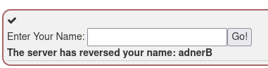
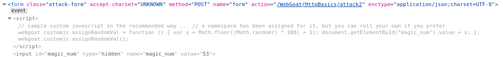
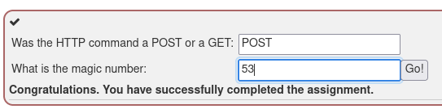
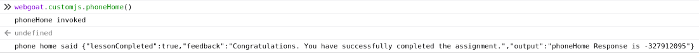
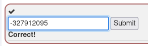
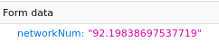
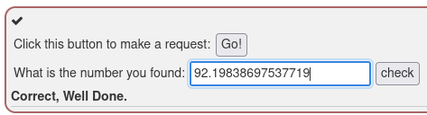

# WebGoat - Solutions

## HTTP Basics

### Goals
The user should become familiar with the features of WebGoat by manipulating the above buttons to view hints, show the HTTP request parameters, the HTTP request cookies, and the Java source code. You may also try using OWASP Zed Attack Proxy for the first time.

### Solution

### The Quiz

## Developer Tools

### Using the console

### Working with the Network tab

